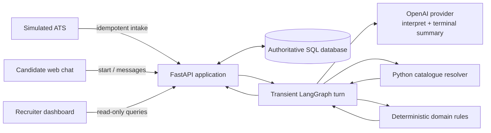
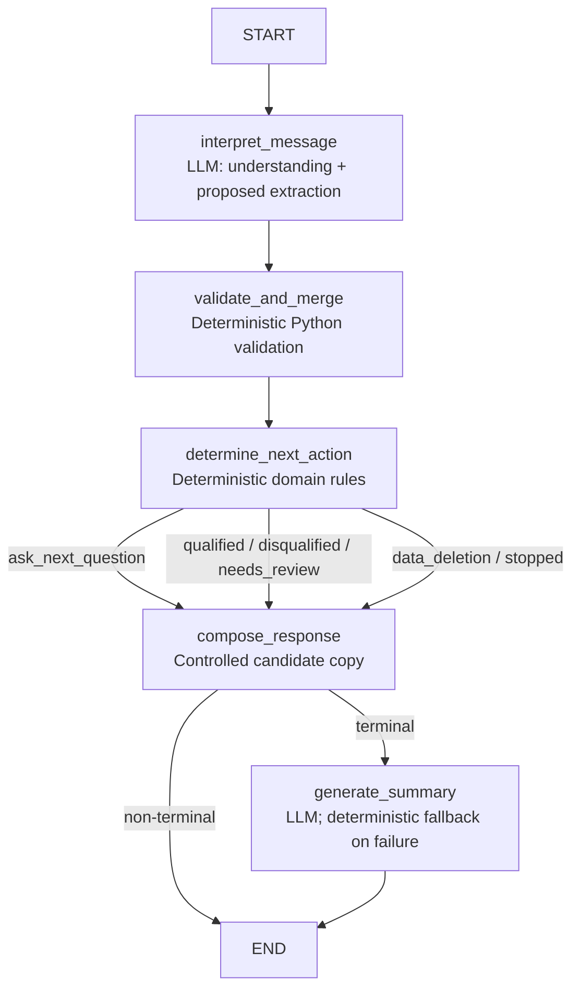

# Architecture and Decisions

## Scope

This document records the initial technical boundaries and provisional choices for
the candidate screening application. The client-facing Process Design is
maintained externally and is intentionally not duplicated here.

The current foundation provides configuration, structured domain contracts,
deterministic eligibility rules, a health endpoint, asynchronous persistence,
simulated ATS intake, a transient conversational workflow, synthetic service-area
data, server-rendered demo surfaces, read-only operational analytics, a minimal
ElevenLabs browser voice adapter, and tests. Retrieval, telephony, re-engagement,
production authentication, and deployment remain planned.

## Five-layer separation

| Layer | Responsibility | Boundary |
| --- | --- | --- |
| LLM | Understand candidate language, extract proposed values, and draft terminal summaries. | It does not decide eligibility, choose stages, or write authoritative state directly. |
| LangGraph | Manage conversation state and explicit transitions between screening stages. | It coordinates work but does not replace domain validation. |
| Pydantic | Define and validate the structured contract shared by application layers. | It guarantees shape and basic constraints, not business outcomes. |
| Domain rules | Validate completion and determine qualification from structured inputs. | It is deterministic and has no model dependency. |
| Database | Hold authoritative application state, decisions, and audit history. | It is the source of truth; chat or graph memory is not. |

This separation keeps probabilistic interpretation outside the decision boundary.
Extracted values must pass through the structured contract and deterministic rules
before they can affect an outcome.

## Provisional technology decisions

| Concern | Provisional choice | Rationale | Status |
| --- | --- | --- | --- |
| Runtime | Python 3.12 or 3.13 | Current language features and broad library support | Adopted |
| HTTP API | FastAPI with Uvicorn | Typed async API with simple operational tooling | Foundation only |
| Configuration | Pydantic Settings | Typed environment-based configuration | Adopted |
| Data contracts | Pydantic | Explicit validation at layer boundaries | Adopted |
| Domain logic | Plain Python functions | Easy to test, audit, and keep deterministic | Adopted |
| Orchestration | LangGraph Graph API | Explicit transient nodes and conditional transitions | Adopted for screening core |
| Model provider | Direct OpenAI Responses API with Structured Outputs | Typed interpretation without delegating decisions | Adopted behind provider boundary |
| Persistence | SQLAlchemy 2.x async with aiosqlite initially | Portable local demo path with a PostgreSQL upgrade route | Adopted for foundation |
| Server-rendered UI | Jinja2 plus HTML/CSS/vanilla JavaScript | Lightweight accessible pages without a separate build system | Adopted for demo surfaces |
| Retrieval | To be selected after approved content is available | Avoid premature knowledge architecture | Planned |
| Voice | ElevenLabs widget plus authenticated webhook tool | Candidate-initiated browser voice over the shared conversation service | Adopted for minimal adapter |
| Testing and linting | pytest, pytest-asyncio, and Ruff | Fast automated feedback | Adopted |

These choices are intentionally provisional where integration behavior, scale, or
client requirements have not yet been validated.

## Persistence and ATS intake

SQLite is the local runtime database and is accessed only through SQLAlchemy's
async engine and sessions. The schema uses portable SQLAlchemy types and UUID
strings so a later PostgreSQL migration does not require changing API identifiers
or domain contracts. Database URLs come from Pydantic Settings through the
`DATABASE_URL` environment variable.

The persistence boundary currently contains five records:

- `CandidateApplication` stores the external ATS identifier, phone number,
  source, preferred language, and application status.
- `Conversation` identifies the durable conversation associated one-to-one with
  an application.
- `Message` provides the complete durable user and assistant conversation history.
- `ScreeningRecord` provides structured screening state independently of any LLM
  or orchestration context.
- `InboundEvent` stores the webhook idempotency receipt and its application link.

All identifiers are UUID strings. Application timestamps are generated as
timezone-aware UTC values. A small SQLAlchemy timestamp type restores UTC timezone
information after SQLite reads, because SQLite itself does not retain timezone
metadata.

ATS intake creates the candidate application, conversation, and inbound event in
one transaction. `InboundEvent.idempotency_key` has a unique database constraint.
Its payload digest is calculated from the validated, canonical JSON request:

- A new key creates the records and returns HTTP 201.
- The same key and digest returns the original identifiers with HTTP 200.
- The same key with a different digest returns HTTP 409.

`CandidateApplication` also has a database-level unique constraint on `(source,
external_application_id)`. When that stable business identity arrives under a new
delivery key, identical canonical candidate data creates only a new inbound-event
receipt and returns the existing application. Conflicting phone or preferred
language data returns HTTP 409.

The unique constraint remains the final concurrency guard even when two deliveries
race. The database is authoritative; LLM or future LangGraph state must never
replace these persisted records as the source of truth.

FastAPI lifespan handling creates the local schema before serving requests and
disposes the engine at shutdown. `create_all` is intentionally limited to this
foundation. Versioned migrations, expected to use Alembic, are required before a
production PostgreSQL deployment.

## Conversational workflow decisions

This diagram mirrors the compiled graph in `app/agent/workflow.py`. All six route
values leave `determine_next_action` through `compose_response`; only
`ask_next_question` ends directly after composition. Every terminal route reaches
`generate_summary`, with deletion using the deterministic fallback directly.

### Why LangGraph

A plain Python state machine could support the current bounded sequence and would
be a reasonable lower-dependency choice. LangGraph is not required to make the
eligibility logic correct, and the domain rules deliberately remain ordinary
Python so they can be audited and tested without the framework.

LangGraph is still useful because it makes state, node boundaries, transitions,
terminal branching, and LLM-versus-deterministic responsibilities explicit. The
compiled graph is straightforward to test with a fake provider and gives a
controlled extension point for future human-in-the-loop review or re-engagement
branches without moving those decisions into prompts.

The implementation follows the official [Graph API](https://docs.langchain.com/oss/python/langgraph/graph-api)
concepts. It has no separate tracing or agent-server dependency.

### Responses API and Pydantic Structured Outputs

The production provider uses `AsyncOpenAI.responses.parse` with a Pydantic model
passed through `text_format`. Structured Outputs are used because the application
needs a typed interpretation boundary: proposed partial fields, detected language,
ambiguity, clarification fields, candidate intent, abuse detection, and one short
debug note. Schema conformance reduces parsing ambiguity, but the parsed object is
still only a proposal that deterministic code must validate. The implementation
follows the [official Structured Outputs guidance](https://developers.openai.com/api/docs/guides/structured-outputs).

The direct OpenAI SDK is used instead of a LangChain model wrapper. This keeps the
provider surface small, exposes Responses API parsing and errors directly, and
avoids coupling domain behavior to an additional abstraction. A
`ScreeningLLMProvider` protocol keeps production OpenAI access replaceable and
allows all tests to use a network-free `FakeScreeningProvider`.

The application constructs the OpenAI client lazily. `OPENAI_API_KEY` is read only
through Pydantic Settings, and startup plus health checks work without it. The
model defaults to configurable `OPENAI_MODEL=gpt-5.6-luna`. The model is an initial
cost-and-latency hypothesis for a narrow, high-volume extraction task, not a final
selection; representative evaluations must validate multilingual extraction,
structured-output reliability, latency, and incorrect-decision risk. The
[official model page](https://developers.openai.com/api/docs/models/gpt-5.6-luna)
confirms Responses API and Structured Outputs support.

### LangGraph Graph API without memory duplication

The Graph API expresses five explicit nodes:

1. `interpret_message`
2. `validate_and_merge`
3. `determine_next_action`
4. `compose_response`
5. `generate_summary`, reached only for terminal routes

The decision node has conditional routes for `ask_next_question`, `qualified`,
`disqualified`, `needs_review`, `data_deletion`, and `stopped`. All routes pass
through constrained response composition; terminal routes then generate a
recruiter summary. If summary generation fails, deterministic code persists a
factual fallback.

No LangGraph checkpointer is configured. Before every turn, the API persists the
user message, loads the complete ordered message history and current
`ScreeningRecord`, and reconstructs graph state. After the graph returns, validated
screening state and the assistant message are committed together. This makes the
database, rather than graph memory or LLM context, authoritative and avoids two
competing recovery mechanisms.

### Deterministic qualification boundary

The LLM may propose facts and flag ambiguity, but it cannot select a stage, route,
or outcome. Plain Python validates configured service areas, date semantics,
clarification retries, and abuse counts before calling the existing eligibility
rules. Availability, schedules, delivery experience, and start date are collected
information rather than rejection criteria. Protected characteristics and
sentiment are outside the structured contract and cannot affect selection.

Candidate-facing responses are deterministic templates constrained by the route.
This guarantees one primary question, prevents internal JSON/debug data from
leaking, and provides a recruiter-handoff response for unapproved job questions
until retrieval is implemented.

### Consent and progress semantics

Conversation start explains the screening purpose, expected duration, and
available languages, then asks for the full name as the opt-in action. A valid
name—alone or in an affirmative sentence—grants continuation consent and is
stored in the same turn. Consent remains process metadata rather than a
qualification criterion. Explicit refusal produces the terminal
`incomplete`/stopped route, never a disqualification.

Progress has seven composite criteria: full name, driver's license, service area,
availability, preferred schedule, delivery experience, and start date. Language
selection and consent are excluded. Delivery experience is complete when the
candidate confirms zero years, or when positive years and at least one platform
are both present.

### Service-area resolution

Service-area eligibility is based on assignment city and zone. Country is optional
when a configured city+zone pair identifies exactly one area; internal persistence
uses canonical country codes (`ES` and `MX`). Country by itself is insufficient,
and city by itself remains incomplete because the candidate must explicitly state
a zone. Country is requested only when the same valid city+zone pair appears under
multiple configured countries.

The deterministic resolver normalizes case, surrounding whitespace, diacritics,
and common punctuation or separators. Explicit Spanish/English aliases cover
common word orders such as `Madrid centro`, `madrid city center`, `downtown
Madrid`, `CDMX centro`, and `downtown Mexico City`. A new raw answer is matched
against the catalogue and may be combined with previously validated partial state;
normalized LLM proposals cannot silently correct approximate candidate wording.
A strong unique typo becomes a pending suggestion and requires explicit
confirmation. An unknown location is disqualifying only after confirmation.
Clarification counters advance only when a candidate fails a requested follow-up,
not when the resolver creates an initial incomplete/suggestion state.

The current Spain and Mexico entries are explicitly synthetic demo data, not
researched Grupo Sazón service locations.

Provider attempts have a short configured timeout. Timeout, connection, and rate
limit failures receive no more than two bounded exponential-backoff retries.
Authentication and invalid-request errors are not retried. A remaining failure
leaves screening fields unchanged and is persisted on the assistant error message
and screening record with provider, model, latency, and error-code metadata.

## Frontend and agent language boundary

The demo uses server-rendered Jinja templates, local CSS, and vanilla JavaScript.
This provides responsive, accessible browser experiences without adding a Node.js
toolchain, client framework, duplicated routing layer, or a second application
runtime. Jinja renders persisted initial state and history; JavaScript handles
progressive interactions with the existing API endpoints.

This does not move agent policy into the browser. OpenAI access, graph execution,
structured validation, orchestration, and eligibility rules remain in Python
behind the API. The candidate page invokes the existing idempotent conversation
start and message endpoints rather than reimplementing workflow logic. It has no
manual language selector: the ATS preference selects the opening, explicit switch
requests always switch, and a sentence-level detected change may switch while
names, locations, and isolated foreign words do not. The response contract returns
the authoritative selected language so interface copy follows the conversation.

### Surface separation

| Surface | Audience | Data and mutation boundary |
| --- | --- | --- |
| Candidate `/screen/{conversation_id}` | One candidate | Candidate-safe transcript and progress; may start and advance only its conversation in this local demo. It never renders prompts, reason codes, model metadata, or structured internal state. |
| Demo launcher `/demo` | Evaluator | Simulates ATS intake through the same authoritative intake operation and generates a candidate link. It is not a recruiter workflow. |
| Recruiter `/recruiter` and `/api/recruiter/*` | Operations evaluator | Read-only application lists, details, transcripts, outcomes, and measured metrics. It cannot change qualification state. |
| ATS `/api/ats/*` | Simulated external system | Creates applications through idempotent, source-specific business identity rules. |
| Developer `/docs` and `/health` | Local developer/operator | API discovery and process health, separate from candidate and recruiter experiences. |

The fictional terracotta, cream, and dark-green identity and its original local
SVG make the demo coherent without copying restaurant branding or implying that
Grupo Sazón is a real organization.

### Analytics definitions and baseline separation

Recruiter metrics are calculated on request from authoritative applications,
screening records, and messages. They are not hardcoded and return zero-valued
results for an empty database.

| Metric | Definition |
| --- | --- |
| Total applications | All persisted `CandidateApplication` rows. |
| Screening started | Applications with a persisted `ScreeningRecord`, created by conversation start. |
| Screening completed | Records ending in a deterministic decision: qualified, disqualified, or needs review. Stopped and deleted records are reported separately. |
| Completion rate | Screening completed divided by screening started; represented as a ratio from 0 to 1. |
| Qualification rate | Qualified divided by screening completed; represented as a ratio from 0 to 1. |
| Interview booking rate | Qualified applications with a persisted interview booking, divided by qualified applications. |
| Stopped | Records with the existing `incomplete` outcome, presented as stopped in the recruiter read model. |
| Deleted | Records with the `deleted` data-deletion outcome. |
| Drop-off by current stage | Operational snapshot of in-progress and stopped non-completions. In-progress records use their persisted stage; stopped records use their first missing screening criterion. This is not proof of abandonment. |
| Average completed duration | Mean seconds from screening-record creation to terminal update for qualified, disqualified, and needs-review records when timestamps are ordered. |
| Average conversation turns | Persisted candidate (`user`) messages divided by screenings started. |
| Recoverable-error count | Persisted messages with a non-null recoverable provider error code. |
| P50 provider latency | Median of non-null persisted message-level provider latencies. |

Measured synthetic demo results are visually and semantically separate from the
client-stated baseline: approximately 200 applications per week, 60% of candidates
not answering phone calls, and 80% of recruiter time spent on unqualified
candidates. The baseline is context supplied by the client, not a measurement from
this database. The UI makes no ROI or improvement claim.

### Interview booking demo boundary

Only candidates with a persisted `qualified` outcome can reserve a recruiter
contact slot. The demo generates capacity-one 30-minute slots on Wednesday and
Thursday, 10:00–14:00, in `Europe/Madrid` for Spain and
`America/Mexico_City` for Mexico. Bookings are persisted in UTC with a unique
country/slot constraint, then displayed in the candidate timezone. This reduces
manual cold calls and drop-off without moving eligibility authority from the
database and deterministic rules.

The measured booking rate is available now. Time-to-book, recruiter calls avoided,
and no-show rate are intended future operational metrics. Confirmation/reminder
messages and recruiter-calendar synchronization are future improvements and are
not implemented by this demo.

### Production authentication boundaries

The current pages are intentionally unauthenticated for local evaluation only.
Before production:

- Recruiter pages and APIs require authenticated identities, authorization, and
  role-based access control.
- Candidate links require signed, scoped, expiring tokens rather than bare UUIDs.
- ATS intake requires verified webhook signatures or narrowly scoped credentials,
  replay controls, and appropriate rate limits.
- Swagger must be protected or disabled, and the application requires transport
  security, CSRF decisions for form surfaces, secure headers, audit controls, and
  privacy/retention review.

FastAPI's Swagger UI remains enabled for local development at `/docs`. Routes are
grouped under `ATS`, `Conversations`, `Voice`, `Recruiter`, and `Operations` so workflows
are discoverable without conflating their audiences. A production deployment must
protect or disable interactive API documentation as part of environment hardening.

## ATS integration contract

The simulated intake endpoint is `POST /api/ats/applications`. Its JSON payload
contains `external_application_id`, `phone_number`, `source` and optional
`preferred_language`; each delivery requires an `Idempotency-Key` header. A new
delivery returns 201, an identical replay returns 200, conflicting reuse of an
idempotency key or business identity returns 409, and invalid input returns 422.

The caller should retry only network/timeout failures with the same idempotency
key and bounded backoff; it must not retry 409 or 422 unchanged. A production ATS
integration additionally requires a verified webhook signature, replay window and
scoped credentials. Those controls are designed, not implemented in this demo.

## Re-engagement design

Re-engagement is not implemented. In production, a scheduler would create an
idempotent 24-hour reminder for an in-progress conversation, then a final reminder
at 72 hours. At seven days it would set the conversation to incomplete. Jobs must
stop on any candidate response, terminal completion, explicit opt-out or deletion,
and must be uniquely keyed per conversation/reminder type to prevent duplicate
delivery.

## Production deployment and 10K candidates/week

At 10K candidates per week, stateless FastAPI replicas can scale horizontally
behind a load balancer while managed PostgreSQL holds authoritative state and
database constraints enforce idempotency and booking capacity. A managed
asynchronous job queue should handle reminders, outbound notifications and other
slow work; request paths should remain short and retry only bounded provider
failures. Provider rate limits, connection timeouts and retries need central
configuration.

Monitoring should cover P50/P95 latency, completion and drop-off by stage,
provider errors, queue age and estimated model cost. Load tests should validate
peak intake, duplicate delivery and booking contention before launch. Security
still requires secret management, HTTPS, signed webhooks, authentication/RBAC,
signed candidate access and retention controls.

Kubernetes and Kafka are unnecessary initially: this workload does not require
multi-cluster orchestration or a high-volume event-streaming platform to reach the
stated scale. Managed replicas, PostgreSQL and a queue are simpler to operate and
can be replaced only when measured throughput or organizational requirements
justify them.

## Immediate constraints

- Service-area entries are synthetic demo configuration, not researched business
  locations.
- Domain rules must remain independent of LLMs and orchestration frameworks.
- Secrets belong in local environment variables and must never be committed.
- The database is the source of truth for application, conversation, message,
  screening, and inbound-event records.
- LangGraph state is reconstructed per turn and is never independently persisted.
- Demo authentication boundaries are documentation, not implemented controls.

## LLM Model Selection

_Last reviewed: 22 August 2026._

No LLM benchmark has been executed for this project. GPT-5.6 Luna is an initial
cost-and-latency hypothesis pending task-specific evaluation; the comparison notes
below describe a proposed evaluation set, not measured results.

### Decision principles

The screening agent does not require the most capable reasoning model available. Its main LLM responsibilities are:

1. Understand short and potentially informal candidate messages.
2. Extract screening information into a structured contract.
3. Ask concise and context-aware follow-up questions.
4. Support Spanish, English, and basic code-switching.
5. Call application tools reliably.
6. Operate with low latency and predictable cost at high volume.

Qualification is not delegated to the LLM. Deterministic domain rules validate the extracted data and produce the final outcome. Therefore, model selection should prioritize extraction reliability, tool-calling performance, multilingual quality, latency, and cost rather than maximum general reasoning capability.

Model recency is used as an initial quality filter, but being the newest or largest model is not sufficient justification. The final choice must be supported by task-specific evaluations.

### Candidate models

| Provider | Model | Decision | Rationale |
|---|---|---|---|
| OpenAI | GPT-5.6 Sol | Not selected | Designed for the most demanding coding and reasoning workloads. Its additional capability and higher cost are not justified for short screening conversations governed by deterministic business rules. |
| OpenAI | GPT-5.6 Terra | Benchmark finalist | A balanced model that may provide stronger instruction following and ambiguity handling than smaller alternatives while remaining suitable for production applications. |
| OpenAI | GPT-5.6 Luna | Benchmark finalist and initial production hypothesis | Optimized for fast, cost-sensitive workloads. It should be sufficient for short multilingual conversations, extraction, and tool calling if validated through evaluations. |
| Anthropic | Claude Opus family | Not selected | Strong reasoning capability, but excessive cost and latency for this narrow, high-volume workflow. |
| Anthropic | Claude Sonnet family | Viable alternative | A strong balanced option, particularly for instruction following and natural dialogue, but it does not add enough initial benchmark diversity to justify testing every provider. |
| Anthropic | Claude Haiku 4.5 | Viable future benchmark | A relevant low-latency alternative. It would be the first Anthropic model evaluated if the initial finalists fail quality or reliability thresholds. |
| Google | Gemini 3.5 Flash | Not selected for the initial benchmark | Its additional capability may be valuable for more complex agentic workflows, but it is not clearly necessary for this bounded collection process. |
| Google | Gemini 3.5 Flash-Lite | Benchmark finalist | Designed for high-throughput and latency-sensitive workloads. It provides a useful cross-provider comparison for multilingual extraction, conversational quality, and cost. |

The initial benchmark therefore compares:

- GPT-5.6 Luna: production-first cost and latency hypothesis.
- GPT-5.6 Terra: higher-capability OpenAI reference.
- Gemini 3.5 Flash-Lite: efficient cross-provider reference.

Anthropic is not considered unsuitable. Claude Haiku 4.5 is the next candidate if the initial benchmark reveals shortcomings or if additional provider diversity is required. Limiting the first experiment to three models keeps the evaluation focused and reproducible.

### Open-weight models

The term “open-weight” is more precise than “open-source” because model licences and permitted uses vary.

#### Self-hosted open-weight models

Self-hosting was not selected for this implementation because it would require:

- GPU infrastructure or an external inference cluster.
- Model serving, scaling, deployment, and version management.
- Monitoring inference latency, memory usage, and availability.
- Security hardening and ongoing operational ownership.
- Additional work to guarantee reliable structured output and tool calling.

Grupo Sazón processes approximately 200 applications per week. At this volume, managed APIs offer a better engineering and operational trade-off. There is also no stated on-premise or strict data-residency requirement that would justify operating dedicated inference infrastructure.

Self-hosting should be reconsidered if the client requires on-premise deployment, strict data localisation, model-level customisation, or sufficiently large sustained volume to justify the operational investment.

#### Hosted open-weight models

Hosted open-weight models run on infrastructure operated by providers such as managed inference platforms. They do not consume the application server's local CPU or GPU.

They are not excluded because of inherently lower quality. They are excluded from the initial benchmark because:

- Model behaviour and service reliability depend on the combination of model and hosting provider.
- Structured-output and tool-calling reliability must be validated separately for each host.
- Provider-specific SLAs, retention policies, observability, and regional availability must also be assessed.
- The expected volume does not currently provide a decisive cost or control advantage.
- Adding more providers would expand the evaluation matrix without answering a materially different question.

A hosted open-weight model would become attractive if it provided a measured cost advantage, better regional deployment, stronger portability, or equivalent extraction reliability under the project evaluation suite.

### Evaluation methodology

Each finalist will run the same simulated conversations, including:

- Spanish and English happy paths.
- Code-switching.
- Multiple fields supplied in one message.
- Ambiguous locations and dates.
- Misspellings and informal language.
- Missing or contradictory answers.
- Candidate questions during screening.
- Prompt-injection and off-topic attempts.
- Repeated abusive language.
- Provider timeouts and malformed structured responses.

The following metrics will be recorded:

- Field-level extraction accuracy.
- Complete-record accuracy.
- Validation and tool-call success rate.
- Incorrect qualification rate.
- Conversation completion rate.
- Average turns to completion.
- P50 and P95 response latency.
- Estimated cost per completed screening.
- Recovery rate after ambiguous input.

Incorrect qualification is a release-blocking failure. Cost and latency will only determine the winner among models that meet the required quality and reliability thresholds.

### Current decision

GPT-5.6 Luna is the initial production hypothesis because this is a bounded, high-volume workflow with deterministic qualification rules. GPT-5.6 Terra and Gemini 3.5 Flash-Lite will be used as comparison points.

The application will access models through a provider adapter so that model selection remains a configuration decision rather than a rewrite. The final production model will be selected from evaluation evidence, not brand preference or benchmark reputation.

### Official references

- [OpenAI model documentation](https://developers.openai.com/api/docs/models)
- [Anthropic model overview](https://platform.claude.com/docs/en/about-claude/models/overview)
- [Anthropic model selection guidance](https://platform.claude.com/docs/en/about-claude/models/choosing-a-model)
- [Gemini 3.5 Flash documentation](https://ai.google.dev/gemini-api/docs/models/gemini-3.5-flash)
- [Gemini 3.5 Flash-Lite documentation](https://ai.google.dev/gemini-api/docs/models/gemini-3.5-flash-lite)
- [ElevenLabs agent prompting guide](https://elevenlabs.io/docs/eleven-agents/best-practices/prompting-guide)
