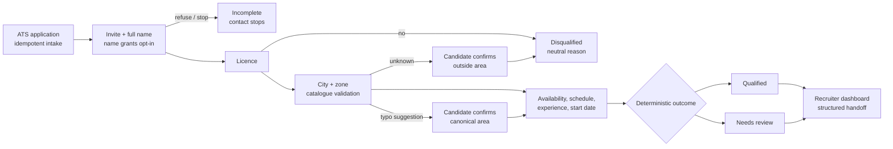

# ORBIO AI / FDE TECHNICAL ASSIGNMENT

## Grupo Sazón Candidate Screening Agent

**Phase 1 — Process Design**  
Mariano Caballero | 22 August 2026 | Version 0.3

### 1. Objective and operating assumptions

**Goal.** Shift recruiter effort from unanswered calls and early manual screening
to qualified-candidate follow-up. Every ATS applicant receives a short asynchronous
screening; validated structured data and deterministic rules produce an auditable
handoff. The client-supplied baseline (about 200 applications/week, 60% unanswered
calls and 80% of recruiter time on unqualified profiles) is context, not a measured
result or ROI claim.

**Channel and disclosure.** The implemented demo is a mobile text experience. The
opening identifies Grupo Sazón, states the approximate three-minute duration, and
asks for the candidate's full name as the opt-in action. The ATS language hint
selects Spanish or English; explicit requests and clear sentence-level changes may
switch language. A name or isolated foreign word does not. Browser voice exists
only as a separate prototype and is not part of the authoritative flow.

**Decision ownership.** The LLM understands language and proposes structured
extraction. Deterministic Python validates catalogue locations and field semantics;
domain rules alone select outcomes. The database—not model or graph memory—is the
source of truth. Demo service areas are synthetic, never researched client sites.

### 2. Business process

1. A simulated ATS webhook creates or reuses one application and conversation;
   event-key and business-identity checks prevent duplicate conversations.
2. A valid full name continues the screening and is stored in the same turn.
   Explicit refusal, stop or deletion intent closes the flow safely.
3. Collect licence and city/zone early. A clear `no` licence disqualifies. Spain or
   Mexico alone is never a service area.
4. Exact configured ES/EN aliases resolve automatically. A validated partial city
   combines with the next zone answer. A strong typo creates a suggestion requiring
   confirmation; a genuinely unknown location also requires confirmation before
   `outside_service_area`. Internal canonicalization does not consume a retry.
5. Collect availability, schedule, experience and start date. Several facts may be
   supplied in one answer; ask only for missing or invalid information.
6. Apply deterministic rules, persist the transcript/state/reason and show
   qualified, disqualified or needs-review cases in the read-only recruiter view.

### 3. Data and validation

| Field | Structured value | Validation and recovery |
| --- | --- | --- |
| Full name | Candidate spelling | Required; a valid answer to the opening grants opt-in. |
| Driver's licence | `yes / no / unclear` | `no` disqualifies; unclear asks again. |
| Service area | raw + country/city/zone | City+zone required. Exact aliases resolve; typo/unknown needs confirmation. |
| Availability | full-time, part-time, weekends | One or more required; collected, not a disqualifier. |
| Preferred schedule | morning, afternoon, evening, flexible | One or more retained; collected, not a disqualifier. |
| Delivery experience | years ≥ 0 + platforms | Zero is valid without platform; positive years require a platform. |
| Start date | raw + confirmed ISO date | Must be explicit and not past; relative dates require confirmation. |

### 4. Outcomes, recovery and boundaries

**Current clarification behaviour.** Preserve useful partial information, acknowledge
it, and ask a targeted clarification (closed alternatives where useful). Needs
review occurs only after two genuinely failed targeted attempts. A single given
name remains pending and asks for a surname; multi-part, hyphenated and apostrophe
names are valid, and an explicitly confirmed legal single name is accepted.
Explicit ES/EN requests or a clear sentence switch language; isolated words/names
do not. Explicit voice requests keep the stage, data and retries unchanged and
link to the same persisted voice workflow.

**Interview and inactivity.** Qualified candidates receive a recruiter summary and
may book a capacity-one Wed/Thu 10:00–14:00 local recruiter-contact slot. Partial
state is persisted if a candidate stops. Proposed production reminders at 24h and
72h and incomplete closure at seven days, plus calendar integration, are not
implemented.

- **Qualified:** all seven criteria valid, licence `yes`, supported service area,
  and no repeated-abuse rule. Completion is not a promise of interview or hire.
- **Disqualified:** only `no_driver_license`, confirmed `outside_service_area`, or
  `repeated_abuse_after_warning`.
- **Needs review:** two failed candidate clarification attempts for unresolved
  invalid/ambiguous information. Provider failure keeps state unchanged and offers
  retry; it does not manufacture an outcome.
- **Stopped/deleted:** refusal or stop remains incomplete, never disqualified.
  Deletion currently records the request/status; physical anonymization is not yet
  implemented.
- **Safety and privacy:** one calm abuse warning precedes deterministic closure.
  Production still requires authentication/RBAC, signed candidate links, webhook
  verification, retention/deletion controls, rate limits and transport hardening.
- **Deferred scope:** approved-content RAG, backend-connected voice, reminders,
  human workflow actions, production deployment and measured business impact.
